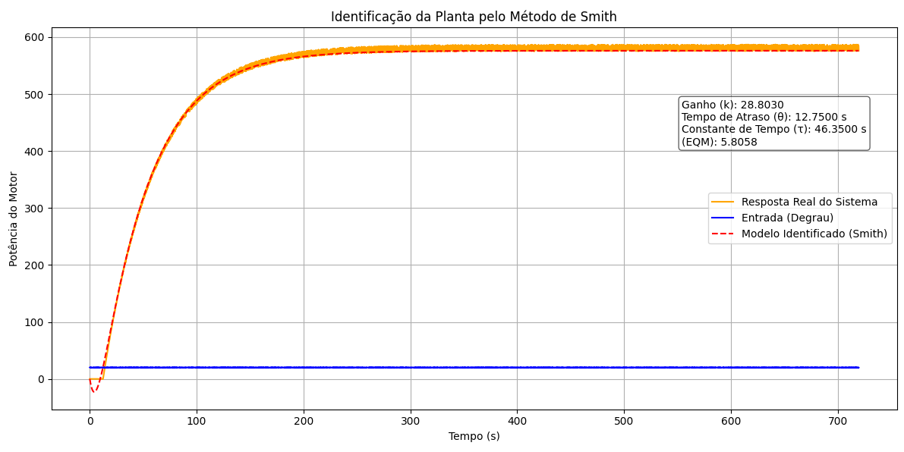
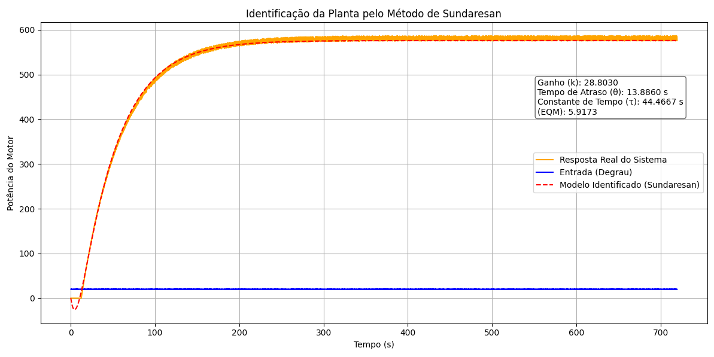

# Projeto Prático de Sistemas Embarcados

A imagem abaixo apresenta o gráfico da identificação da função de transferência utilizando o Método de Smith.

A imagem abaixo apresenta o gráfico da identificação da função de transferência utilizando o Método de Sundaresan.

