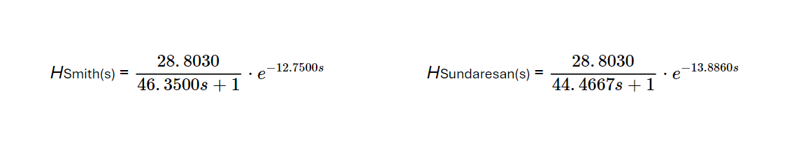
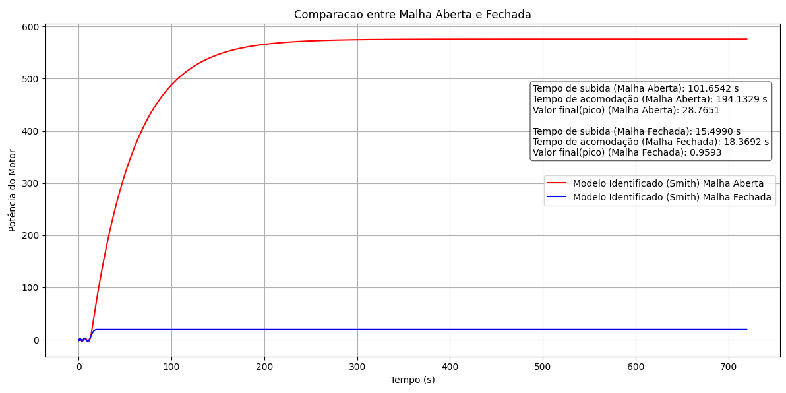

# Projeto Prático de Sistemas Embarcados

## Métodos de Smith e Sundaresan

 - A imagem abaixo apresenta a resposta ao degrau obtida pela identificação pelos métodos de Smith e Sundaresan, juntamente com suas respectivas funções de transferência.

## Comparação entre malha (aberta e fechada) do método Smith

 - A imagem abaixo apresenta a comparação entre a malha aberta e fechada obtidas pelo método Smith

## Controlador PID (IMC)

 - A imagem abaixo apresenta a sintonização de um Controlador PID de acordo com o método IMC

.png)

## Controlador PID (CHR sem sobrevalor)

 - A imagem abaixo apresenta a sintonização de um Controlador PID de acordo com o método CHR sem sobrevalor

.png)

