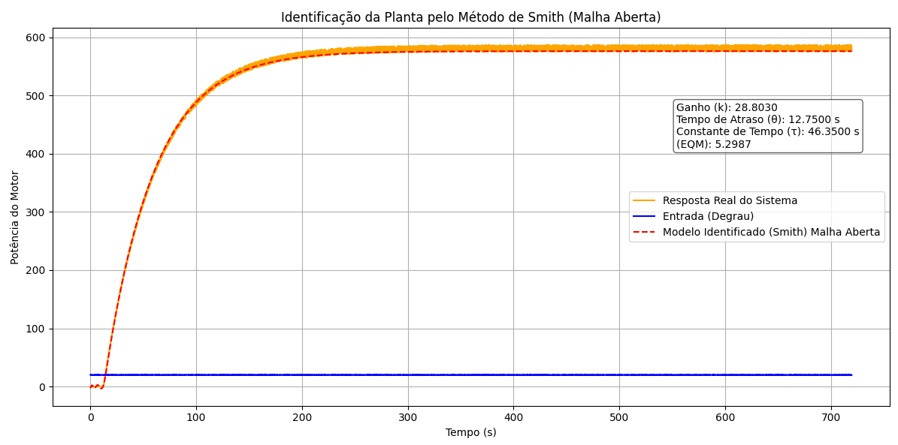
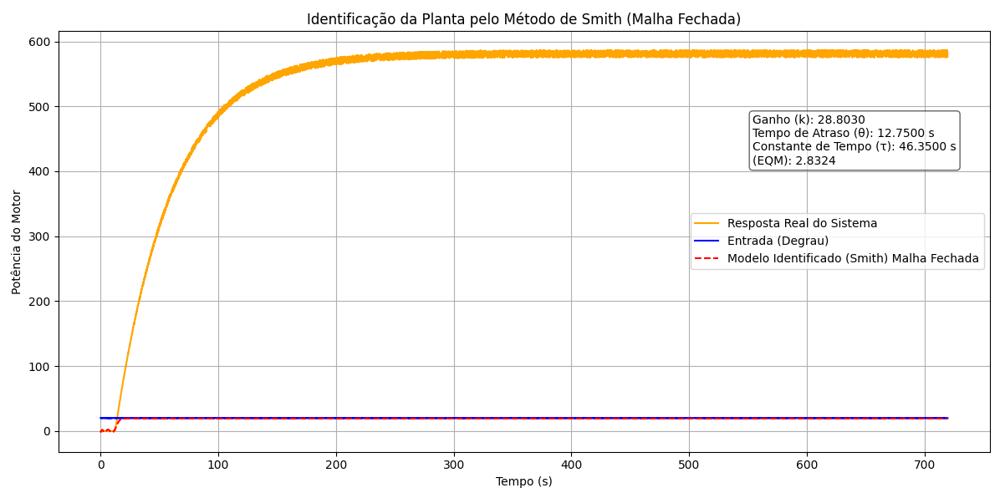
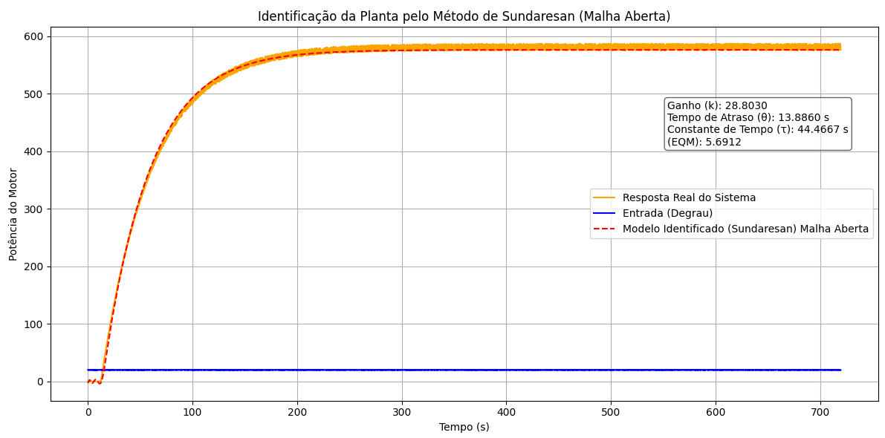
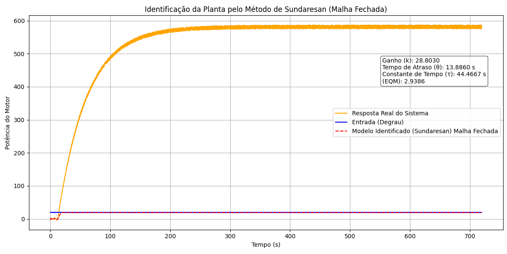

# Projeto Prático de Sistemas Embarcados

A imagem abaixo apresenta o gráfico da identificação da função de transferência utilizando o Método de Smith em malha aberta.

A imagem abaixo apresenta o gráfico da identificação da função de transferência utilizando o Método de Smith em malha fechada.

A imagem abaixo apresenta o gráfico da identificação da função de transferência utilizando o Método de Sundaresan em malha aberta.

A imagem abaixo apresenta o gráfico da identificação da função de transferência utilizando o Método de Sundaresan em malha fechada.

